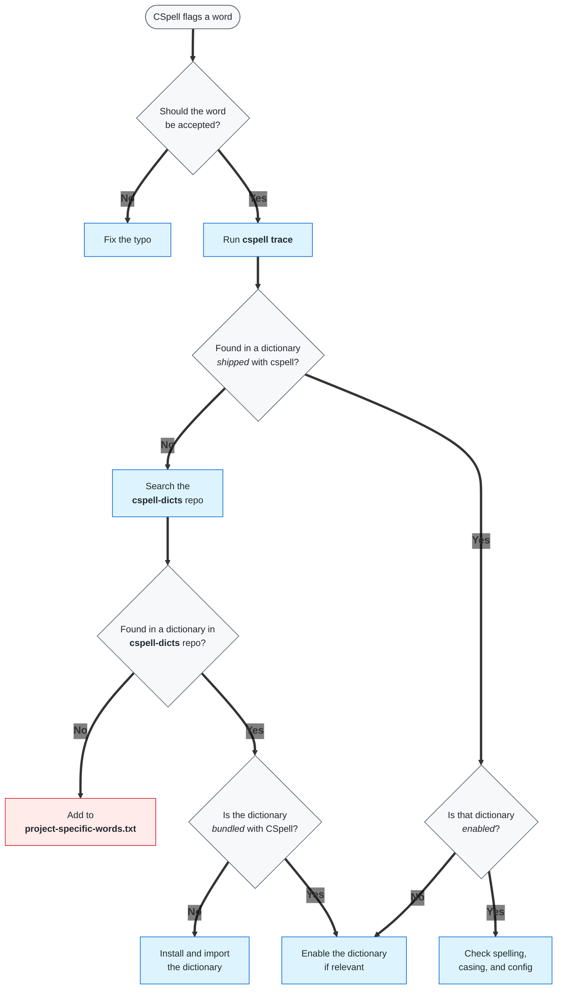

# Spell checking with CSpell

> This guide explains how spell checking is configured in this template, how the setup works and what to do when it incorrectly flags words.

<p>
  <a href="https://github.com/streetsidesoftware/cspell-action">CSpell GitHub Action</a> ·
  <a href="https://cspell.org/">CSpell docs</a> ·
  <a href="https://github.com/streetsidesoftware/cspell-dicts#cspell-dicts">CSpell Dictionaries</a>
</p>

## What is CSpell?

CSpell is a spell checker for code and documentation. It scans repository files and flags words that are not recognised by the configured languages, dictionaries, ignore patterns, or project-specific word lists.

> [!NOTE]
> In this template, CSpell runs automatically on pull requests to help catch spelling mistakes before changes are merged.

### Why CSpell?

CSpell is designed for spell checking code repositories, not only documentation. It can check documentation, comments, configuration files, and other repository content, while allowing us to configure it for specific projects and repositories.

CSpell has an official GitHub Action and a large set of dictionaries that can be enabled when needed. Other tools may be better for specific use cases, for example:

- [Vale](https://github.com/vale-cli/vale-action) is a style and writing-rule linter. It is better suited for enforcing style guides, preferred terminology, tone, and wording conventions in documentation and other written text. Vale could be added alongside CSpell if stricter writing-style checks are needed.
- [Codespell](https://github.com/marketplace/actions/codespell-with-annotations) checks code for common misspellings. It is better suited for catching known typo patterns than for dictionary-based spell checking against full language and technical dictionaries.

For this template, CSpell gives the best balance between useful typo detection, configurability, and ease of use in the GitHub Actions.

## Files in this setup

This template uses one GitHub Actions workflow file and one CSpell configuration directory. The configuration files are kept in `.config/cspell` instead of the repository root to keep the repository structured and make the template as easy as possible to use out of the box.

```text
.
├── .github/
│   └── workflows/
│       └── spellcheck.yml
└── .config/
    └── cspell/
        ├── README.md
        ├── cspell-config.yml
        └── project-specific-words.txt
```

| File | Purpose |
| ------ | --------- |
| `.github/workflows/spellcheck.yml` | Runs CSpell |
| `.config/cspell/cspell-config.yml` | CSpell configuration file used by the workflow. Defines languages, dictionaries, ignored patterns and project-specific word lists. |
| `.config/cspell/project-specific-words.txt` | List of valid repository-specific words that are not covered by any available CSpell dictionaries but that CSpell should allow |
| `.config/cspell/README.md` | This guide |

## How this setup works

The workflow explicitly includes some default action settings. The workflow would work the same way without these settings being present, but including them increases clarity and reduces the risk of confusion.

- The spell check runs when a PR is opened or updated
- The workflow is configured to check changed files in the PR
  - `incremental_files_only: true` tells CSpell to only check the PR diff, meaning files changed in the PR. It does not check the rest of the repository.
  - `files: ''` tells CSpell to check all file types selected by the action. This is the _default_.
- The CSpell action uses `.config/cspell/cspell-config.yml` for language, dictionary, ignored patterns, and project-specific-word settings.
  - `language` configures the languages used during the spell check, here British English and Swedish
  - `import` imports dictionaries that need to be installed in the workflow before CSpell runs, in this case Swedish and People Names
  - `caseSensitive` allows CSpell to distinguish between different casing, e.g. SciLifeLab and scilifelab.
  - `dictionaries` list dictionaries from the [`cspell-dicts` repository](https://github.com/streetsidesoftware/cspell-dicts#cspell-dicts) that do not require installation before use. They are bundled with CSpell and are enabled when listed under the `dictionaries` section
  - `dictionaryDefinitions` imports the custom `project-specific-words.txt` as a dictionary. These are words that are not included in any other [CSpell-available dictionary](https://github.com/streetsidesoftware/cspell-dicts#cspell-dicts) but that we consider correct and CSpell should not flag.
  - `ignoreRegExpList` tells CSpell to ignore specific patterns
- If CSpell finds spelling issues, the workflow fails. Spelling issues are reported as GitHub annotations, and suggestions are shown when available.

## What to do when CSpell flags a correct word

If CSpell flags a word that you know is correct, **first** check whether it's already covered by a CSpell dictionary. **Do not** immediately add it to `project-specific-words.txt`.

The flowchart below shows what to do in different scenarios. These map to specific subsections.



**Jump to:**

- [Run `cspell trace`](#run-cspell-trace)
- [Enable a dictionary](#enable-a-dictionary)
- [Search the `cspell-dicts` repo](#search-the-cspell-dicts-repo)
- [Install and import a dictionary](#install-and-import-a-dictionary)
- [Add word to `project-specific-words.txt`](#add-word-to-project-specific-wordstxt)

### Run `cspell trace`

Open a terminal window and run the following command in the repository root:

```bash
npx cspell trace --config .config/cspell/cspell-config.yml [YOUR-WORD]
```

The output is a table with the following headers (`Dictionary Location` column is excluded in examples because it is irrelevant in this case):

- `Word`: The word you searched for
- `F`: `*` if the word is found in the dictionary to the right, `-` if the word is not found
- `Dictionary`: Name of a dictionary that was searched. If there is a `*` next to the name, the dictionary is enabled in your configuration

#### Example outputs

1. `[YOUR-WORD]` was found in a dictionary that **is** enabled by your current CSpell configuration. CSpell should not be flagging `[YOUR-WORD]` as incorrect.

    ```bash
    Word        F   Dictionary                                                        
    [...]
    [YOUR-WORD] *   a-dict*         # [YOUR-WORD] was found in 'a-dict', and 'a-dict' is enabled
    [...]
    ```

    **What to do:** Check spelling, casing and config.

2. `[YOUR-WORD]` was found in a dictionary that is **not** enabled by your current CSpell configuration.

    ```bash
    Word         F   Dictionary
    [...]
    [YOUR-WORDS] *   another-dict   # [YOUR-WORD] was found in 'another-dict', but 'another-dict' is not enabled
    [...]
    ```

    **What to do:** [Enable the dictionary](#enable-a-dictionary) **if** a dictionary containing the word is relevant to your project.

3. `[YOUR-WORD]` was **not** found in any of the dictionaries _available_ in your current CSpell configuration.

    ```bash
    Word         F   Dictionary
    [...]
    [YOUR-WORDS] -   some-dict*         # 'some-dict' is enabled, but [YOUR-WORD] was not found in it
    [YOUR-WORDS] -   yet-another-dict   # 'yet-another-dict' is not enabled, and [YOUR-WORD] was not found in it
    [...]
    ```

    **What to do:** [Search the `cspell-dicts` repo](#search-the-cspell-dicts-repo) for a suitable dictionary.

### Enable a dictionary

Open your `.config/cspell/cspell-config.yml` file and add the dictionary to `dictionaries`, in alphabetical order.

Example:

```yml
dictionaries:
  - companies
  - cpp-compound-words
  - fonts
  - some-dict  # some-dict is now enabled in the cspell configuration
  [...]
```

### Search the `cspell-dicts` repo

If [`cspell trace`](#run-cspell-trace) doesn't find the word, search the [`cspell-dicts` repository](https://github.com/streetsidesoftware/cspell-dicts) to check whether the word exists in another CSpell dictionary.

In the GitHub search field, search for:

```text
repo:streetsidesoftware/cspell-dicts [YOUR-WORD]
```

**What to do with the result:**

- If the word is found in a file under `dictionaries/<dictionary-id>/dict/`, the word exists in a CSpell dictionary.
- Use the `<dictionary-id>` from the file path to find the dictionary in the `cspell-dicts` `README`.
- If the dictionary **is** marked as Bundled with CSpell, [enable it](#enable-a-dictionary).
- If the dictionary is **not** marked as `Bundled with CSpell`, [install and import the dictionary package](#install-and-import-a-dictionary).
- If the search has no relevant results, [add the word to `.config/cspell/project-specific-words.txt`](#add-word-to-project-specific-wordstxt).

### Install and import a dictionary

If you find a word in a relevant dictionary available in the `cspell-dicts` repository, first install and import it locally and [run `cspell trace`](#run-cspell-trace) to verify that the word is recognized by your updated CSpell configuration. When you have confirmed that it works as expected, install the dictionary in your workflow.

1. Install the dictionary locally: `npm install @cspell/dict-<dictionary-id>`
2. Import the dictionary in your `.config/cspell/cspell-config.yml`

    ```yml
      # Example
      import:
      - "@cspell/dict-sv/cspell-ext.json"
      - "@cspell/dict-people-names/cspell-ext.json"
      - "@cspell/dict-<dictionary-id>/cspell-ext.json"
    ```

3. Use [`cspell trace`](#run-cspell-trace) to verify that the updated CSpell configuration recognises the word
4. Install the dictionary in the `.github/workflows/spellcheck.yml` workflow file

    ```yml
        # Example
        - name: Install CSpell Dictionaries (...)
          run: npm install --no-save (...) @cspell/dict-<dictionary-id>
    ```

5. Push the changes to your remote branch.
6. If you have an open PR, check the `Files changed`. There should **not** be an annotation for the correct word in the PR diff (`Files changed` tab).

### Add word to `project-specific-words.txt`

Only add a word to `.config/cspell/project-specific-words.txt` if it is correct, relevant to this repository, and not covered by a suitable CSpell dictionary.

Add one word per line, in alphabetical order.

```text
exampleword
project-specific-word
some-tool-name
```

After adding the word, push the change and check that the PR annotation is gone.

## Notes and limitations

The configuration in this template sets British as the English version because that is the standard at Data Centre. However, 

- en-gb but it does not flag all american spellings due to... plus also the other dicts include american spellings