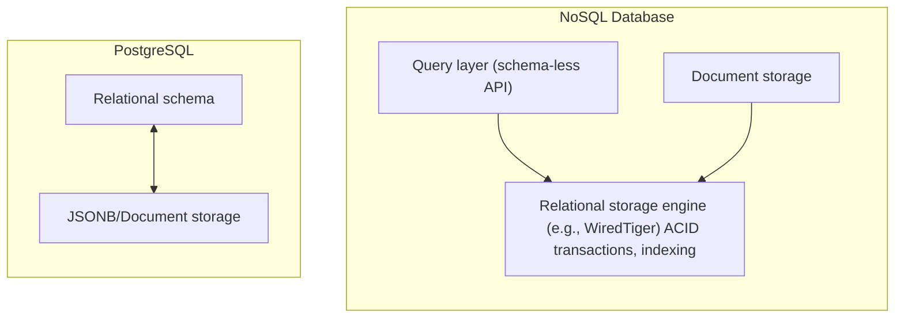

# Why PostgreSQL should be the default database choice even for document-oriented workloads

This document explains why PostgreSQL should not only be considered as _the "go-to" choice for a relational database_, but also a serious option for document-oriented workloads.

## PostgreSQL: the gold standard for databases

PostgreSQL has earned its reputation as a premier relational database for several reasons:

- **Reliability**: PostgreSQL is fully ACID-compliant, ensuring data integrity and consistency across all transactions. This adherence to core database principles makes it a trustworthy option for mission-critical applications.
- **Scalability**: PostgreSQL supports both vertical and horizontal scaling, accommodating everything from small applications to systems serving millions of users, such as [GitLab](https://docs.gitlab.com/ee/development/architecture.html) and [Instagram](https://instagram-engineering.com/keeping-instagram-up-with-over-a-million-new-users-in-twelve-hours-b75298b782c5), ensuring that performance needs are met as projects grow.
- **Community and ecosystem**: As a mature open-source DBMS, PostgreSQL benefits from a very active and global community. This ensures continuous development, extensive documentation, and a rich ecosystem of tools and extensions like [PostGIS](https://postgis.net/), which provides geographic information capabilities for spatial data management, and [pg_partman](https://github.com/pgpartman/pg_partman), which help manage table partitioning to efficiently handle large datasets.
- **Performance**: PostgreSQL also benefits from [advanced indexing](https://www.postgresql.org/docs/current/indexes.html) and [parallel query](https://www.postgresql.org/docs/current/parallel-query.html) execution to deliver high performance in complex workload situations.
- **Open source**: Unlike DBMSs with restrictive licences (MongoDB, Elasticsearch, InfluxDB), PostgreSQL is fully open source.

## Handling document-oriented workloads in PostgreSQL

A [document-oriented database](https://en.wikipedia.org/wiki/Document-oriented_database) stores data as self-contained documents (often JSON-like) that encapsulate a record and its nested fields.
It emphasises flexible schema (documents in the same collection/table may differ) and tends to model relationships via embedding rather than normalisation.
Typical uses include webhook payloads, user preferences, catalogue attributes, and content metadata.

Developers often lean toward MongoDB to manage unstructured or semi-structured data, which is arguably the flagship of NoSQL DBMSs.
However, scenarios in which data has no relational aspects at all are very uncommon.
While document stores are well suited for high-throughput writes and straightforward document retrieval, workloads that require cross-entity relationships, joins, or complex aggregations are typically better served by relational databases with document capabilities such as PostgreSQL.
In these cases, PostgreSQL can often deliver close enough or superior performance compared to pure document stores.
For detailed benchmarks and performance comparison, see [Postgres VS Mongo: Performance Comparison for Semi-Structured Data](https://astordev.github.io/articles/postgres-mongo-performance/), [EnterpriseDB’s comparison](https://www.enterprisedb.com/blog/comparison-mongodb-vs-postgresql), and [MinervaDB joins comparison](https://minervadb.xyz/mongodb-vs-postgresql-postgres-joins/), but bear in mind that database benchmarks are heavily impacted by the data types involved, the database configuration, optimization, and deployment as well as the hardware it ran on.

PostgreSQL natively supports formats like `JSON`, `JSONB`, and `bytea`, which make it well‑suited for document‑oriented applications involving semi‑structured and unstructured data while maintaining its relational strengths.
Consolidating both relational and document capabilities within PostgreSQL reduces the complexity of adopting additional technologies:

- Reduces operational complexity (one engine to provision, monitor, back up, and secure).
- Provides end-to-end ACID transactions across both relational tables and embedded documents (`JSONB`).
- Simplifies access control, disaster recovery, and backup/restore with a single toolchain.
- Avoids data duplication and consistency drift between a relational store and a separate document store.
- Enables powerful analytics with standard SQL across both structured columns and JSON fields.

Examples:

- Storing third‑party webhook payloads in `JSONB` alongside relational references to users/entities.
- Modelling user preferences or feature flags as JSON without schema churn while keeping core relations normalised.
- Capturing audit trails or enrichment metadata as JSON while joining to relational entities for reporting.

### JSON/JSONB (and bytea) in PostgreSQL

PostgreSQL’s `JSON`, `JSONB`, and `bytea` data types are designed for efficient storage and querying of semi-structured and unstructured data.

- `JSON` (text): preserves whitespace and key order, and stores the exact input. Prefer when you rarely query inside the document and mostly store/return the original payload.
- `JSONB` (binary): stored in a decomposed binary form with canonical ordering. Prefer for frequent querying/filtering/aggregation within documents.
- `bytea`: opaque binary. Prefer for blobs (e.g. PDFs, images) when you do not query inside the content in PostgreSQL.

Notable features include:

- **Indexing**: `JSONB` supports `GIN` and `GiST` indexes for keys/values and containment queries.
- **Rich querying**: specific operators and functions (e.g. `->`, `->>`, `#>`, `@>`, `?`, and `jsonb_path_query`) enable deep searches and aggregations.
- **Performance**: `JSONB` optimises storage and read operations for many workloads, but performance always depends on data shape and indexes, so design matters.
- **Tooling and extensions**: extensions such as [ZSON](https://github.com/postgrespro/zson) and [jsquery](https://github.com/postgrespro/jsquery) further enhance compression and query capabilities for JSON documents.

### MongoDB vs PostgreSQL

Many document databases like MongoDB use storage engines (such as WiredTiger) that offer transactions and indexing similar to traditional relational databases.
In PostgreSQL, these features are built in and work seamlessly with both regular tables and JSONB documents.

**PostgreSQL as a hybrid relational and document store vs. NoSQL databases using relational DB under the hood**

| Feature                | PostgreSQL                                     | MongoDB                                     |
| ---------------------- | ---------------------------------------------- | ------------------------------------------- |
| **Data model**         | Relational + document (`JSON/JSONB`)           | Document                                    |
| **Query language**     | SQL + JSON operators/functions                 | MongoDB Query Language                      |
| **Schema enforcement** | Strong (constraints/types), optional for JSONB | Flexible (schema-less, optional validation) |
| **Main index types**   | B-tree, GIN/GiST (also for JSONB), BRIN        | Single, compound, multikey, wildcard        |
| **Scalability**        | Vertical, horizontal via sharding/replication  | Strong horizontal sharding                  |

## When to use document-oriented databases

A document-oriented database, like MongoDB, can be advantageous in scenarios requiring very high write throughput, deeply nested JSON structures, or highly flexible, schema‑less data (e.g. real‑time logging systems, highly dynamic data models).
However, these situations tend to be less common in the workloads that DC typically addresses.

The **key takeaway** here is: _the early benefits of a schema‑less approach can diminish once non‑anticipated relational data and cross‑entity queries become central. At that point, a relational engine like PostgreSQL often becomes the more suitable choice_.

## Conclusion and recommendation

By adopting PostgreSQL as the standard DBMS for DC projects, we focus on a versatile and high‑performing DBMS that excels in both relational and document‑oriented workloads which also has an official backend for Django.
By combining powerful features like `JSON`/`JSONB` support, advanced indexing, and extensibility with the reliability of full ACID compliance, it is a unified solution for most of our use cases until our data models stabilise and data types and shapes become clearer.
More restrictive by design, alternative DBMSs should only be considered for specific and well‑identified needs where PostgreSQL is not the best fit.

### TL;DR

1. **Relational workload**: use PostgreSQL.
2. **Document-oriented workload**: use PostgreSQL unless:
   - you are absolutely certain that your data model is devoid of relationships and will remain so.
   - write throughput demands exceed PostgreSQL’s capabilities.
   - highly flexible schema evolution is a core requirement.
3. **Other**: assess your needs thoroughly and establish a complete data schema before referring to the [comparison table](https://github.com/ScilifelabDataCentre/development-guidelines/blob/paved_path_tech/paved_path_tools.md#databases).